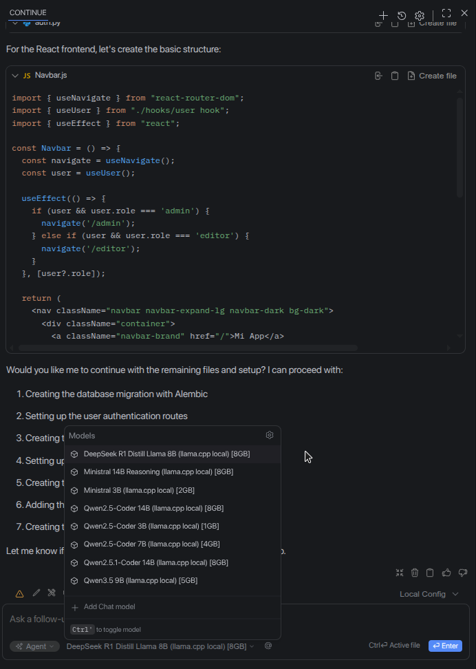

Llama.CPP in Docker and config for VSCode Continue plugin
==

Note: **I'm just testing. This is highly experimental!**

0. Install [Docker+Docker-Compose](https://gist.github.com/Koratsuki/cb4e065e8fe7ad3ea3cf34df9bd25c94).
1. Download models[2], .gguf files and place them inside ./models.
2. Run:

```bash
docker-compose up -d
```

3. Example Continue plugin config for Visual Studio Code inside `./vscode/config.yaml`.

4. Testing models

|  |
|:--:|
| *Image 1. Testing models.* |

References:
==

[1] https://github.com/ggml-org/llama.cpp/blob/master/docs/docker.md

[2] https://github.com/ggml-org/llama.cpp#obtaining-and-quantizing-models

[3] https://coffeejourneys.blog/home-lab-local-llms-docker-amd/
